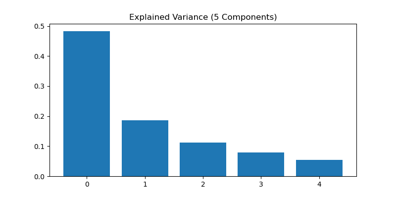
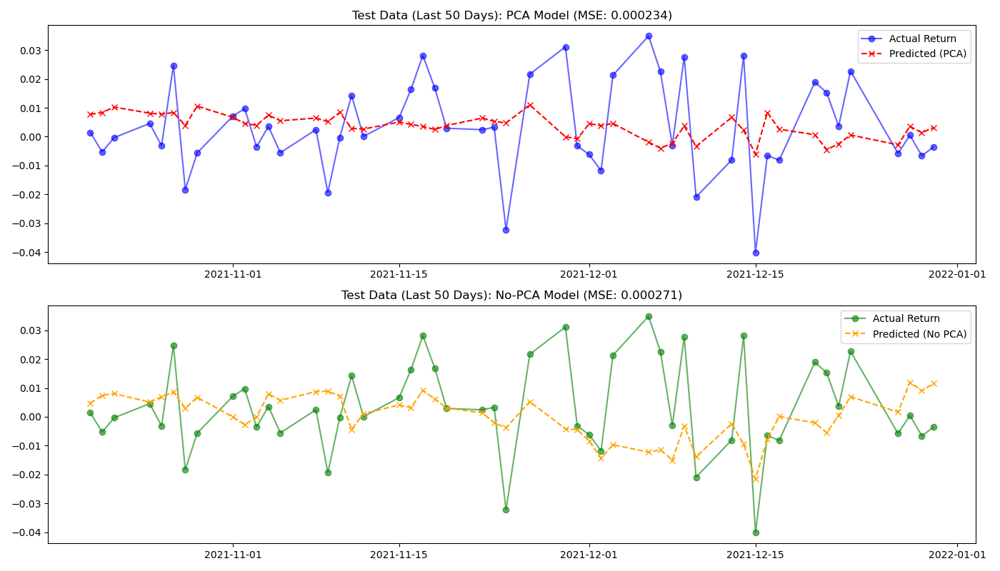
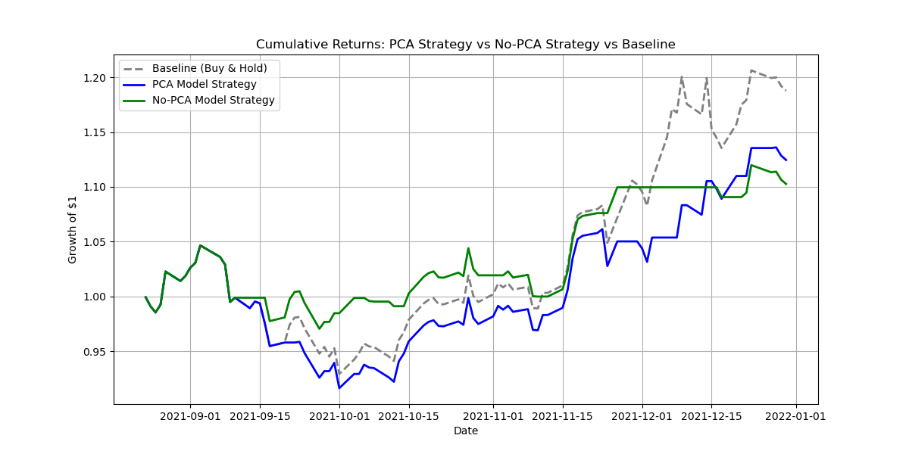

# Stock Return Prediction: PCA vs. High-Dimensional Linear Regression

## Project Overview
This project explores the impact of **Principal Component Analysis (PCA)** on the performance of a Linear Regression model used to predict daily stock returns.

Using **Apple (AAPL)** historical data (2020–2022), the project compares two approaches:
1.  **Full-Feature Model:** A Linear Regression model trained on 14 different technical indicators.
2.  **PCA-Reduced Model:** A Linear Regression model trained on the top 5 Principal Components derived from those indicators.

The goal is to determine if dimensionality reduction helps reduce noise and improve the signal-to-noise ratio in financial time-series prediction.

---

## 📊 Methodology & Feature Engineering

### 1. Data Collection
Data is sourced via the `yfinance` API.
* **Asset:** AAPL (Apple Inc.)
* **Period:** Jan 1, 2020 – Jan 1, 2022

### 2. Feature Engineering (14 Indicators)
We generated a mix of trend, momentum, and volatility indicators to capture market dynamics:

* **Momentum:** Relative Strength Index (RSI), Rate of Change (ROC), Williams %R, CCI.
* **Trend:** MACD, MACD Signal, SMA Distances (20 & 50 days).
* **Volatility:** Bollinger Band Width, ATR (Normalized), Rolling Volatility.
* **Volume:** Volume % Change.
* **Price Structure:** High-Low Percentage, Log Returns.

### 3. Dimensionality Reduction (PCA)
Financial features are often highly correlated (multicollinear). For example, SMA_20 and SMA_50 often move together. We use **PCA (Principal Component Analysis)** to orthogonalize these features into uncorrelated components, reducing the dataset from 14 dimensions to 5 latent components.


---

## 📈 Results & Analysis

### 1. Feature Variance (PCA Analysis)
Before training, we analyzed how much information (variance) each Principal Component holds.



* **Analysis:** The first component (Component 0) alone captures nearly **50% of the variance** in the dataset.
* **Interpretation:** This suggests high multicollinearity in the original features. The first component likely represents the broad "market trend" or momentum that most indicators are agreeing on. By using the top 5 components, we retain the majority of the signal while discarding noise found in the lower-variance components.

### 2. Prediction Accuracy (MSE Comparison)
We compared the Mean Squared Error (MSE) of both models on the test set.



* **Visual Inspection:** The plot above zooms in on the last 50 days of the test set.
    * **Top (PCA):** The red dashed line tracks the prediction using PCA.
    * **Bottom (No-PCA):** The orange dashed line tracks the prediction using all features.
* **Performance:**
    * **PCA Model MSE:** ~0.000234
    * **No-PCA Model MSE:** ~0.000271
* **Conclusion:** The PCA model achieved a **lower MSE**, indicating it generalized better. The No-PCA model likely suffered from mild overfitting due to the noise present in the raw technical indicators.

### 3. Strategy Backtesting (Cumulative Returns)
We implemented a simple trading strategy: **Buy if the model predicts a positive return for the next day, otherwise stay in cash.**



* **Gray Line (Baseline):** Buy & Hold strategy (simply holding AAPL stock).
* **Blue Line (PCA Strategy):** Trading based on PCA model signals.
* **Green Line (No-PCA Strategy):** Trading based on raw feature model signals.
* **Interpretation:**
    * **Market Context:** The test period (late 2021) was generally bullish/choppy.
    * **Comparison:** While the models successfully captured profit, they slightly underperformed the aggressive "Buy & Hold" baseline. This is common in strong bull markets, as trading strategies often exit positions during minor pullbacks, missing out on some upside.
    * **PCA vs. No-PCA:** The PCA strategy (Blue) tracked closer to the baseline and generally showed smoother equity curves compared to the No-PCA strategy, reinforcing the idea that PCA helped filter out false trading signals.

---

## 🛠️ Installation & Usage

### Prerequisites
* Python 3.7+
* pip

### Libraries Used
```txt
numpy
pandas
scikit-learn
yfinance
matplotlib
